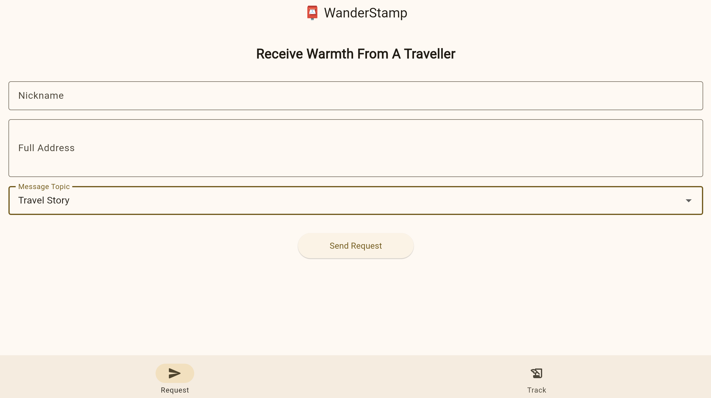
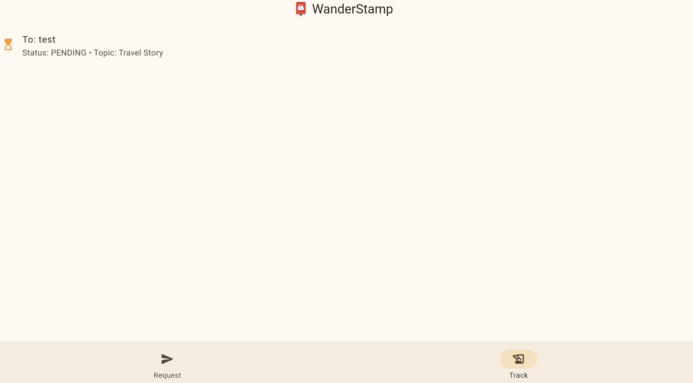
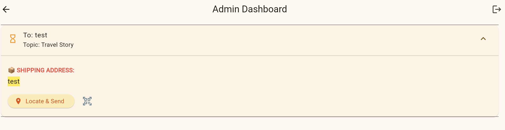

# 📮 WanderStamp

**"A handwritten postcard, a warm message from a journey."**

A warm Flutter Web app to connect travelers with friends and strangers alike through handwritten postcards. Features a real-time journey tracker, secure privacy controls, and Firebase integration. Spreading kindness and stories, one stamp at a time. 🌍✨

## 🌟 Why I Built This?

In a world of instant messaging, the physical touch of a handwritten postcard is becoming rare. Built this because:
*   **Anonymity is Comfort**: Sometimes it's easier to share deep thoughts or encouragement with a stranger than with someone familiar.
*   **Spreading Warmth**: A simple "You're doing great" from a different city can change someone's day.

## ✨ Features

*   **✉️ Request a Postcard**: Strangers can pick a topic (Inspiration, Comfort, Travel Story, or Daily Life) and submit their mailing address.
*   **🎈 Surprise Success UI**: A smooth, animated feedback dialog when a request is submitted.
*   **📍 Public Tracker**: A real-time list showing the journey of each postcard (pending ➔ sent ➔ received) without exposing private addresses.
*   **🤳 QR Code Feedback**: Each postcard comes with a unique link. When the recipient scans it, the public status automatically updates to "Received."

## 🛠️ Tech Stack

*   **Frontend**: [Flutter Web](https://flutter.dev) (Material 3)
*   **Backend**: [Firebase Firestore](https://firebase.google.com)
*   **Authentication**: [Firebase Auth](https://firebase.google.com) (Admin-only)
*   **State Management**: [Provider](https://pub.dev)
*   **Deployment**: [GitHub Actions](https://github.com) & GitHub Pages

## 🛡️ Security & Privacy

*   **Address Protection**: Shipping addresses are **strictly hidden** from the public.
*   **Firestore Rules**: Database access is enforced via server-side rules.
*   **Minimal Data**: Only a nickname and address are required to participate.

## 📺 Demonstration
[Check out the App here!](https://your-username.github.io)

### 1. Web

### 2. Admin Dashboard

