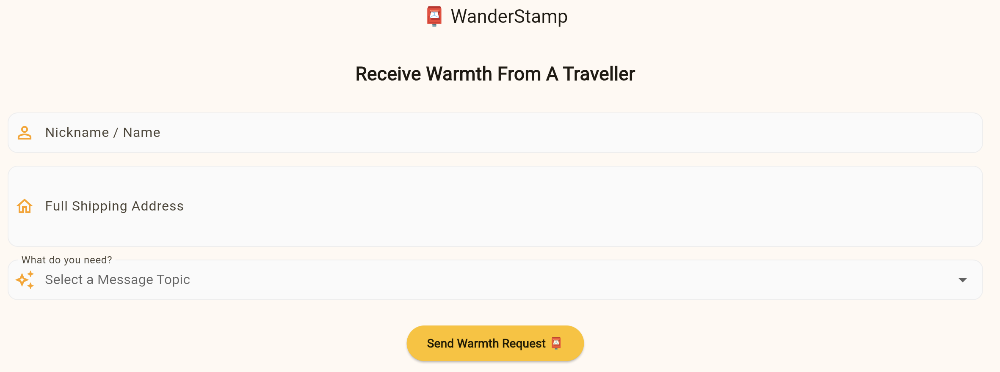
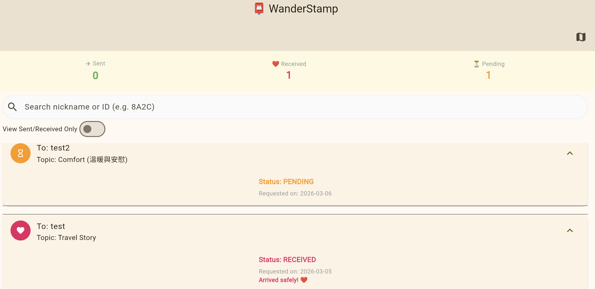
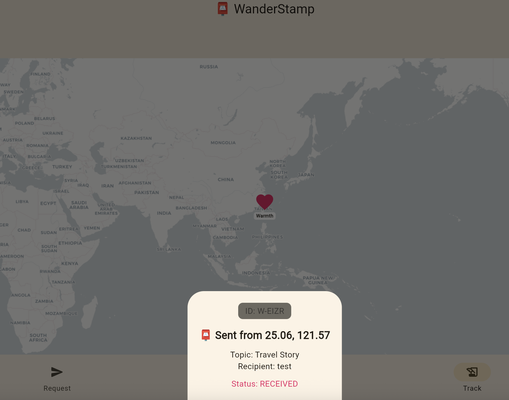
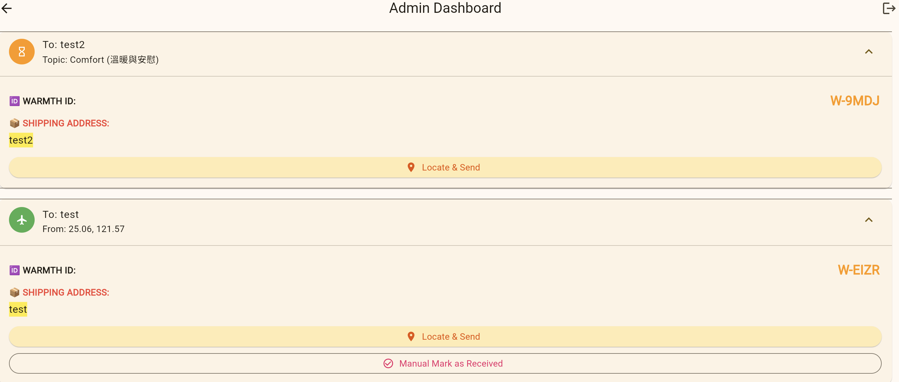
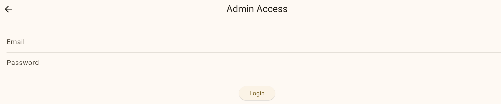
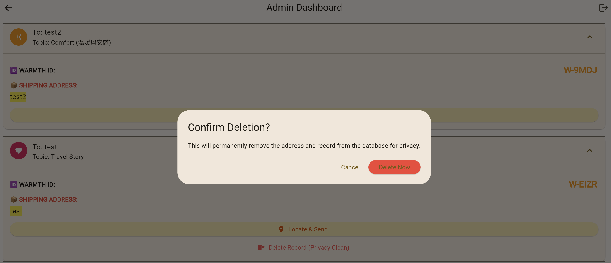
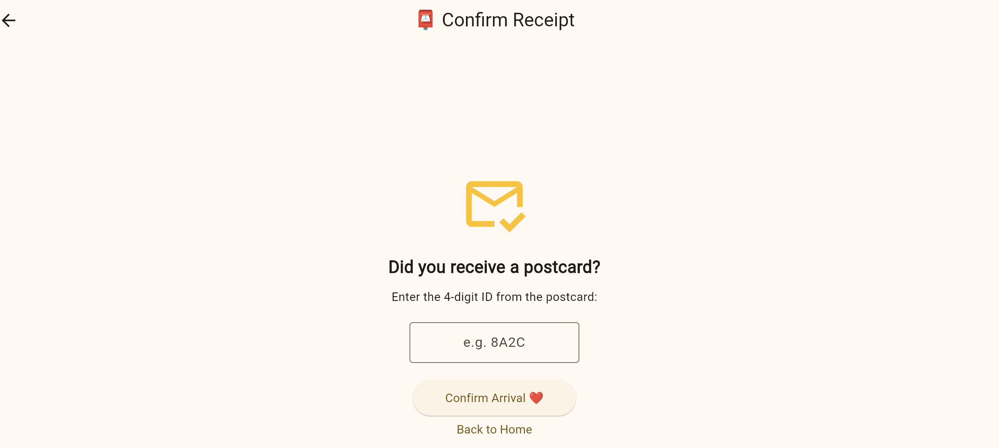

# 📮 WanderStamp

> **"A handwritten postcard to bridge hearts—whether we are friends, acquaintances, or yet to meet."**

WanderStamp is a warm Flutter Web application designed to connect travelers with people across the globe. The goal is simple: send postcard to anyone who needs a little bit of warmth, encouragement, or a travel story from afar. Spreading kindness and stories, one stamp at a time. 🌍✨

## 🌐 Live Demo
[Check out the App here!](https://leo0331.github.io/WarmthFromAfar/)

## 🌟 Why I Built This?

In a world of instant messaging, the physical touch of a handwritten postcard is becoming rare:
*   **Meaningful Connections**: Sometimes a handwritten note speaks louder than a text, helping us stay connected or spark kindness with a stranger.
*   **Anonymity is Comfort**: Sometimes it's easier to share deep thoughts or encouragement with a stranger than with someone familiar.
*   **Spreading Warmth**: A simple "You're doing great" from a different city can change someone's day.

## ✨ Features

*   **✉️ Request a Postcard**: Anyone can pick a customized topic (Inspiration, Comfort, Heartbreak Healing, etc.) and submit their mailing address safely.
*   **🎈 Surprise Success UI**: A smooth, animated feedback dialog providing a **unique 4-digit Warmth ID (W-XXXX)** for tracking.
*   **📍 Public Tracker**: A real-time dashboard showing the journey of each postcard (pending ➔ sent ➔ received). 
*   **📊 Topic Insights**: A live chart showing which message topics are currently most requested by the community.
*   **🔒 Secure Admin Dashboard**: A hidden entrance (activated by a secret gesture) for the traveler to manage requests and use **GPS-stamping** to mark postcards as sent.
*   **❤️ Warmth Receipt**: Recipients can manually enter their **W-XXXX ID** on the site to mark the postcard as "Received" with a simple, heart-warming UI.

## 🛠️ Tech Stack

*   **Frontend**: [Flutter Web](https://flutter.dev) (Material 3)
*   **Backend**: [Firebase Firestore](https://firebase.google.com) (Real-time Database)
*   **Authentication**: [Firebase Auth](https://firebase.google.com) (Admin-only)
*   **State Management**: [Provider](https://pub.dev)
*   **Deployment**: [GitHub Actions](https://github.com) & GitHub Pages

## 🛡️ Security & Privacy

*   **Address Protection**: Shipping addresses are **strictly hidden** from the public. Only the authenticated admin can access them.
*   **Firestore Rules**: Database access is enforced via server-side security rules.
*   **Minimal Data**: Only a nickname and address are required to participate.

## 📺 Demonstration

### 1. User Interface

### 2. Admin Dashboard

### 3. Received Page

## 🌍 How to Participate
1.  **Request**: Visit the [Live Demo](https://leo0331.github.io/WarmthFromAfar/) and fill out the form.
2.  **Confirm**: Once received, visit the [Arrival Page](https://leo0331.github.io/WarmthFromAfar/#/received) and enter your ID to share the joy!

## 📱 Install as a Mobile App (PWA)

WanderStamp is a **Progressive Web App (PWA)**. You can install it on your phone without downloading from the App Store or Google Play.

### For Android (Chrome)
1. Open the [Live Demo](https://leo0331.github.io/WarmthFromAfar/) in Chrome.
2. Tap the **three dots (⋮)** in the top-right corner.
3. Select **"Install app"** or **"Add to Home screen"**.
4. The **WanderStamp** icon will appear on your home screen!

### For iOS (Safari)
1. Open the [Live Demo](https://leo0331.github.io/WarmthFromAfar/) in Safari.
2. Tap the **Share** button (square with an up arrow) at the bottom.
3. Scroll down and tap **"Add to Home Screen"**.
4. Tap **Add** in the top-right corner.

## ✨ Mobile Experience
*   **Haptic Feedback**: Enjoy tactile vibrations when submitting requests or confirming arrivals.
*   **Standalone Mode**: Once installed, the browser address bar is hidden for a true app-like experience.
*   **Offline Ready**: Core features remain accessible even with a spotty travel connection.
