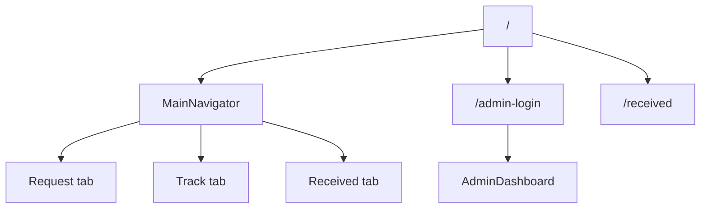

# WanderStamp Flow

## User Flow

1. User opens app landing route (`/`).
2. User submits postcard request on `RequestPage`.
3. App writes request to Firestore through `FirebaseService`.
4. User receives tracking ID (`W-XXXX`) from success dialog.
5. User tracks progress on `TrackingPage` with ID.
6. Recipient confirms arrival on `/received`.
7. Optional public feedback is shown on Wall of Warmth.

## Admin Flow

1. Admin enters hidden login route (`/admin-login`).
2. Authenticated admin opens dashboard.
3. Admin updates postcard status (`pending -> sent -> received`).
4. Optional traveler note and sent location are persisted.
5. Public tracker and insights update from real-time data streams.

## Route Flow

