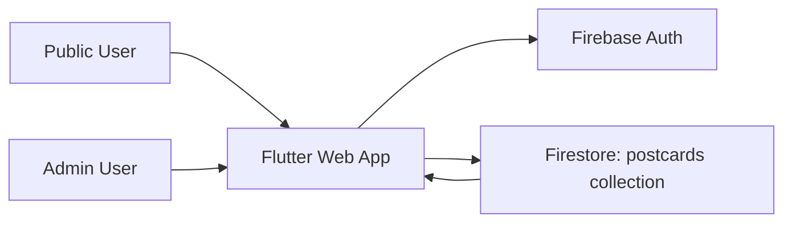

# WanderStamp System Design Deep Dive

## 1) System Context

WanderStamp is a Flutter Web app with one public product flow and one lightweight admin flow:

- Public: request postcard, track progress, confirm receipt, optionally publish feedback.
- Admin: login, mark as sent/received, update journey details, delete record for privacy clean-up.

Current stack:

- Frontend/runtime: Flutter Web (`lib/main.dart`)
- State: `provider` (`AuthProvider`)
- Data/auth: Firebase Firestore + Firebase Auth (`FirebaseService`, `AuthProvider`)

Design goal in current architecture: ship quickly with a single client codebase and minimal backend operations.

---

## 2) High-Level Architecture

Key boundaries:

- `main.dart`: app bootstrap, route dispatch, top-level composition.
- `views/*`: route-level interaction and UI orchestration.
- `widgets/*`: reusable UI blocks.
- `services/firebase_service.dart`: data access boundary.
- `models/postcard.dart`: typed domain schema for Firestore documents.

---

## 3) Runtime Flow and Design Choices

### 3.1 App bootstrap

Chosen:

- `bootstrapApp()` performs `ensureInitialized`, `initializeFirebase`, and provider-wrapped `runApp`.

Why:

- Keeps startup sequence explicit and testable without changing runtime behavior.

Alternative:

- Put initialization directly in `main()` and mock global APIs in tests.

Tradeoff:

- Current choice adds tiny abstraction but improves testability and startup verification.

### 3.2 Routing and navigation

Chosen:

- Single `MaterialApp` with `onGenerateRoute` + `MainNavigator` tabs via `IndexedStack`.

Why:

- Small route surface (`/`, `/admin-login`, `/received`), easy deep-link argument handoff.
- `IndexedStack` preserves tab state without extra state-management complexity.

Alternatives:

- `go_router` with declarative route table and URL sync.
- Nested `Navigator` per tab.

Tradeoff:

- Current approach is simpler; larger route graphs would favor `go_router`.

### 3.3 Data access layer

Chosen:

- Singleton-style `FirebaseService` factory with test override hook (`setMockInstance`).

Why:

- Fast adoption in small app; reduces boilerplate DI wiring.

Alternatives:

- Repository pattern + constructor injection via provider/riverpod.
- Use-cases/interactors over repository layer.

Tradeoff:

- Current approach is simple but harder to evolve to multiple data sources or strict isolation.

### 3.4 Auth state

Chosen:

- `AuthProvider` listens to `authStateChanges()` and exposes `isAdmin`.

Why:

- Minimal surface for current admin-gating needs.

Alternatives:

- Rich auth state model (`unauthenticated/loading/authenticated/error`) via sealed classes.
- Riverpod/BLoC state graph.

Tradeoff:

- Current model is lean but less expressive for complex auth UX or role matrix.

---

## 4) Data Structures: Why This vs Alternatives

## 4.1 Firestore schema: one `postcards` collection, one document per postcard

Chosen structure:

- Flat collection with all lifecycle fields in one document.

Why chosen:

- Simple reads for tracker and admin list.
- Straightforward client updates to single record.

Alternatives:

- Split collections (`requests`, `journey_events`, `receipts`).
- Subcollection per postcard (`postcards/{id}/events/*`) event-sourcing style.
- Relational DB (Cloud SQL/Supabase) with normalized tables.

Tradeoff:

- Flat docs optimize development speed and query simplicity.
- Event-heavy analytics/history and strict normalization would favor event/subcollection model.

## 4.2 `Postcard` as typed immutable model with nullable optional fields

Chosen structure:

- One class with required core fields + nullable optional fields (`lat`, `travelerNote`, etc.).

Why chosen:

- Stronger than raw `Map<String, dynamic>`.
- Handles incremental lifecycle enrichment without migrations across multiple classes.

Alternatives:

- Raw map access in UI/services.
- Multiple status-specific types (`PendingPostcard`, `SentPostcard`, `ReceivedPostcard`).
- Freezed union/sealed states.

Tradeoff:

- Single model is pragmatic; unions offer stronger compile-time guarantees but more complexity.

## 4.3 In-memory filtering and derivations on `List<Postcard>`

Chosen structure:

- Stream full list, then compute:
  - `filteredData` (search + switch)
  - `topicStats` (`Map<String, int>`)
  - `queueLookup` (`Map<String, int>`)

Why chosen:

- Easy to reason about; no server-side aggregation pipeline needed.

Alternatives:

- Firestore query composition (`where`, `orderBy`, pagination cursors).
- Precomputed analytics collection (`topic_counts`) maintained by Cloud Functions.
- Queue index stored and transactionally maintained in DB.

Tradeoff:

- Current client-side derivation is simple but can become expensive with large dataset sizes.

## 4.4 Topic stats as `Map<String, int>`

Chosen structure:

- Hash map frequency counter.

Why chosen:

- O(n) counting pass, O(1) average update/lookups, naturally fits bar ranking.

Alternatives:

- Server-generated aggregate docs.
- Ordered tree / heap if continuous top-k updates are required at scale.

Tradeoff:

- Great for small-medium dataset; server-side aggregation is better for large global traffic.

## 4.5 Queue position as `Map<String, int>`

Chosen structure:

- Sort pending list by request date, then map doc ID to rank.

Why chosen:

- Provides deterministic queue rank without persisting queue index.

Alternatives:

- Persist `queueIndex` field on write/update with transactions.
- Priority queue data structure managed backend-side.

Tradeoff:

- Current method avoids write-time coordination but recalculates every render path.

## 4.6 Short ID lookup by suffix match

Chosen structure:

- `getPostcardByShortId` fetches collection and scans `doc.id` suffix.

Why chosen:

- No extra field needed; easy to ship.

Alternatives:

- Persist indexed `shortId` field (`W-XXXX`) and query with equality.
- Dedicated lookup collection mapping shortId -> docId.

Tradeoff:

- Current scan is simple but O(n) and collision-prone as volume grows.
- Indexed shortId is better for scale and predictable latency.

---

## 5) Architecture Tradeoffs Summary

Strengths:

- Fast iteration velocity.
- Small cognitive load.
- Easy onboarding and testability for core flows.

Known limits:

- Client-side aggregation/filtering may not scale well.
- Singleton service pattern can constrain modularity at larger team size.
- Suffix scan lookup is operationally weak under high volume.

When to evolve:

- Dataset > low thousands active documents in frequent tracker sessions.
- Multiple admins with richer role/permission needs.
- Need for audit-grade event history and analytics.

---

## 6) Deep Dive Question Prep (with Expected Talking Points)

## Q1: Why Firestore single-collection instead of normalized/event model?

Answer points:

- We optimized for product speed and simple read paths.
- One document per postcard reduces join complexity in client.
- We accept denormalization and would migrate to event subcollections when analytics/history depth justifies it.

## Q2: Why compute stats and queue on client?

Answer points:

- Low operational complexity and no backend jobs.
- Sufficient at current scale.
- Planned evolution: Cloud Functions materialized counters and server-side filtering/pagination.

## Q3: Why provider + singleton service over heavier architecture?

Answer points:

- Team/project size favors reduced boilerplate.
- Test hooks (`setMockInstance`, bootstrap injection) keep core units testable.
- Alternative layers were deferred to avoid premature abstraction.

## Q4: How would you fix short-ID collision/performance risk?

Answer points:

- Add explicit `shortId` field with uniqueness policy.
- Query by indexed equality instead of collection scan.
- Optionally add retry-on-collision generation and monitor collision metrics.

## Q5: What are trust boundaries?

Answer points:

- Admin actions require Firebase Auth.
- Public flows can submit/confirm with constrained rule paths.
- Security rules are the authoritative guardrail, not only client checks.

## Q6: Biggest scaling risks and first remediation steps?

Answer points:

- Risks: full-collection reads, client sorting/filtering, suffix scan.
- First steps: query pagination, aggregate docs, indexed lookup field, caching strategy.

## Q7: How would you support richer journey history?

Answer points:

- Add `events` subcollection per postcard (`requested`, `writing`, `sent`, `received`).
- Keep latest snapshot fields in root doc for fast UI, history in events for audit.

---

## 7) Recommended Evolution Path (Low-Risk Sequence)

1. Add `shortId` field + indexed lookup query.
2. Move topic stats to pre-aggregated collection.
3. Add pagination/windowing for public tracker.
4. Introduce repository abstraction only where change pressure is real.
5. Add event subcollection if timeline/audit requirements grow.

This sequence preserves current behavior while addressing highest leverage scaling risks first.
