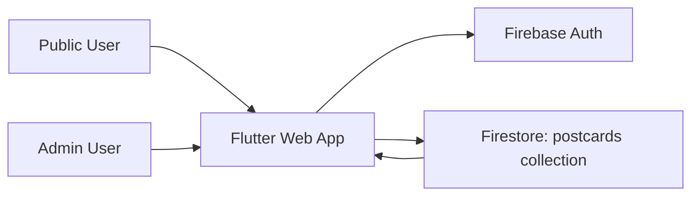

# WanderStamp 系統設計深度解析

## 1) 系統脈絡（System Context）

WanderStamp 是一個 Flutter Web 應用，包含一條公開使用者流程與一條精簡管理者流程：

- 公開使用者：提出明信片請求、追蹤進度、確認收件、可選擇公開回饋。
- 管理者：登入、標記寄出/已收件、更新旅程資訊、執行隱私清理（刪除紀錄）。

目前技術堆疊：

- 前端與執行環境：Flutter Web（`lib/main.dart`）
- 狀態管理：`provider`（`AuthProvider`）
- 資料與身份驗證：Firebase Firestore + Firebase Auth（`FirebaseService`、`AuthProvider`）

目前架構的核心目標：在單一前端程式碼基底下，以最小後端維運成本快速迭代。

---

## 2) 高階架構（High-Level Architecture）

主要邊界：

- `main.dart`：啟動流程、路由分派、頂層組裝。
- `views/*`：頁面層互動與 UI 編排。
- `widgets/*`：可重用元件。
- `services/firebase_service.dart`：資料存取邊界。
- `models/postcard.dart`：Firestore 文件對應的型別化領域模型。

---

## 3) 執行流程與設計選擇（Runtime Flow and Design Choices）

### 3.1 啟動流程（App bootstrap）

目前選擇：

- 以 `bootstrapApp()` 串接 `ensureInitialized`、`initializeFirebase`、`runApp`（含 provider 包裝）。

選擇原因：

- 啟動順序明確，且可測試，不影響既有執行行為。

替代方案：

- 將初始化全部放回 `main()`，於測試中 mock 全域 API。

取捨：

- 目前多一層薄抽象，但換來更好的啟動可測試性與可驗證性。

### 3.2 路由與導覽（Routing and navigation）

目前選擇：

- `MaterialApp` + `onGenerateRoute`，搭配 `MainNavigator` 與 `IndexedStack` 分頁。

選擇原因：

- 路由面積小（`/`、`/admin-login`、`/received`），深連結參數傳遞容易。
- `IndexedStack` 可保留分頁狀態，避免額外狀態管理複雜度。

替代方案：

- `go_router`（宣告式路由 + URL 同步）。
- 每個分頁使用巢狀 `Navigator`。

取捨：

- 現行方式更精簡；若日後路由規模變大，`go_router` 會更有優勢。

### 3.3 資料存取層（Data access layer）

目前選擇：

- 以 singleton 風格的 `FirebaseService` 工廠，並保留 `setMockInstance` 測試覆寫入口。

選擇原因：

- 對小型專案導入快，DI 樣板碼少。

替代方案：

- Repository pattern + constructor injection（配合 provider/riverpod）。
- 在 repository 之上再做 use-case/interactor 分層。

取捨：

- 現行做法簡單，但在多資料來源或強隔離需求下可擴展性較弱。

### 3.4 驗證狀態（Auth state）

目前選擇：

- `AuthProvider` 監聽 `authStateChanges()`，並暴露 `isAdmin`。

選擇原因：

- 滿足目前管理者門檻需求，介面最小。

替代方案：

- 更完整的 auth 狀態模型（`unauthenticated/loading/authenticated/error`，sealed classes）。
- Riverpod/BLoC 狀態圖。

取捨：

- 現行模型精簡，但在複雜驗證流程與多角色矩陣下表達力較弱。

---

## 4) 資料結構：為什麼這樣選，而不是其他做法

## 4.1 Firestore 結構：單一 `postcards` collection、每張明信片一份文件

目前選擇：

- 扁平化 collection，一份文件包含完整生命週期欄位。

選擇原因：

- 追蹤頁與管理頁讀取路徑簡單。
- 前端更新單一文件直覺易維護。

替代方案：

- 拆 collection（`requests`、`journey_events`、`receipts`）。
- 每張明信片設 subcollection（`postcards/{id}/events/*`，偏事件溯源）。
- 改用關聯式資料庫（Cloud SQL / Supabase）做正規化表結構。

取捨：

- 扁平文件優勢在開發速度與查詢簡潔。
- 若偏重事件分析、歷史追溯與強正規化，事件/子集合模型更合適。

## 4.2 `Postcard` 模型：型別化單一模型 + 可空（nullable）擴充欄位

目前選擇：

- 單一 class，核心欄位必填，進階欄位可空（如 `lat`、`travelerNote`）。

選擇原因：

- 比 `Map<String, dynamic>` 更安全。
- 可漸進擴充生命週期欄位，不需同時維護多組模型遷移。

替代方案：

- UI/Service 直接讀寫 raw map。
- 依狀態拆型別（`PendingPostcard`、`SentPostcard`、`ReceivedPostcard`）。
- Freezed union/sealed states。

取捨：

- 單一模型務實高效；union 型別在編譯期保障更強，但複雜度較高。

## 4.3 前端記憶體內運算：以 `List<Postcard>` 做過濾與衍生

目前選擇：

- 先串流全量列表，再在 client 端計算：
  - `filteredData`（搜尋 + 開關）
  - `topicStats`（`Map<String, int>`）
  - `queueLookup`（`Map<String, int>`）

選擇原因：

- 易理解、易除錯，不需先建後端聚合流程。

替代方案：

- Firestore 查詢組合（`where`、`orderBy`、cursor 分頁）。
- Cloud Functions 維護預先聚合集合（例如 `topic_counts`）。
- 佇列序號改為後端交易維護。

取捨：

- 現行方式簡單，但資料量上升後 client 計算成本會增加。

## 4.4 主題統計：`Map<String, int>`

目前選擇：

- Hash map 作頻率計數。

選擇原因：

- 單次 O(n) 統計、平均 O(1) 更新與查找，適合排行榜展示。

替代方案：

- 伺服端產出聚合文件。
- 若需要高頻 top-k，即時更新可用有序樹/heap。

取捨：

- 小到中量資料效果好；大流量下建議改為伺服端聚合。

## 4.5 佇列名次：`Map<String, int>`

目前選擇：

- 先依申請時間排序 pending 清單，再映射 doc ID -> 名次。

選擇原因：

- 不需持久化 `queueIndex`，即可得到穩定名次。

替代方案：

- 在寫入/狀態更新時以交易維護 `queueIndex`。
- 後端維護優先佇列資料結構。

取捨：

- 現行避免寫入協調成本，但每次渲染都要重算。

## 4.6 短碼查詢：以文件 ID 後綴比對

目前選擇：

- `getPostcardByShortId` 取回集合後掃描 `doc.id` 後綴。

選擇原因：

- 無需新增欄位即可快速上線。

替代方案：

- 持久化且可索引的 `shortId` 欄位（`W-XXXX`），用等值查詢。
- 另建 lookup collection（shortId -> docId）。

取捨：

- 現行做法簡單但 O(n)，且資料量增大時有碰撞與延遲風險。
- 可索引 `shortId` 在可預期延遲與擴展性上更佳。

---

## 5) 架構取捨總結（Architecture Tradeoffs Summary）

優勢：

- 迭代速度快。
- 認知負擔低。
- 核心流程易上手、易測試。

限制：

- 前端聚合/過濾在規模化時可能吃力。
- Singleton service 對大型團隊模組化有約束。
- 後綴掃描查詢在高資料量下操作風險較高。

建議升級時機：

- 常態活躍文件量接近或超過數千筆，且追蹤頁高頻使用。
- 管理者增多、角色與權限需求變複雜。
- 需要事件級審計、歷史回放與分析能力。

---

## 6) 深度訪談問題準備（含建議答題重點）

## Q1：為何用 Firestore 單集合，而非正規化/事件模型？

答題重點：

- 當時優先目標是產品速度與簡單讀路徑。
- 一張明信片一份文件可降低前端 join 複雜度。
- 接受適度反正規化；當分析/歷史深度提升時再演進至事件子集合。

## Q2：為何統計與佇列在前端算？

答題重點：

- 後端維運複雜度低，初期無需額外 job。
- 目前規模可接受。
- 演進方向已規劃：Cloud Functions 物化統計 + 伺服端分頁/過濾。

## Q3：為何用 provider + singleton，而非更重架構？

答題重點：

- 團隊/專案規模適合低樣板。
- 已保留測試接縫（`setMockInstance`、bootstrap 注入）。
- 延後抽象是刻意避免過早設計（premature abstraction）。

## Q4：短碼碰撞與效能風險要怎麼修？

答題重點：

- 新增顯式 `shortId` 欄位與唯一性策略。
- 改為索引等值查詢，移除全量掃描。
- 可加碰撞重試與監控指標。

## Q5：系統信任邊界在哪？

答題重點：

- 管理者操作必須經 Firebase Auth。
- 公開流程可提交/確認，但需依規則限制。
- 真正的權限控制以 Firestore Security Rules 為準，不只靠 client 檢查。

## Q6：最大擴展風險與第一步改善是什麼？

答題重點：

- 風險：全量讀取、前端排序/過濾、短碼掃描。
- 第一波措施：查詢分頁、聚合文件、索引化短碼查詢、快取策略。

## Q7：若要支援更完整旅程歷史，會怎麼做？

答題重點：

- 每張明信片新增 `events` 子集合（`requested`、`writing`、`sent`、`received`）。
- 根文件維持最新快照供 UI 快讀，完整事件留在 history 供審計分析。

---

## 7) 建議演進路徑（低風險順序）

1. 新增 `shortId` 欄位並改用索引查詢。
2. 將主題統計移至預聚合集合。
3. 為公開追蹤頁加入分頁/視窗化讀取。
4. 僅在變更壓力高的區塊導入 repository 抽象。
5. 若時間軸/審計需求上升，再加事件子集合模型。

此順序可在維持既有行為的前提下，先解決擴展性風險最高的部分。
